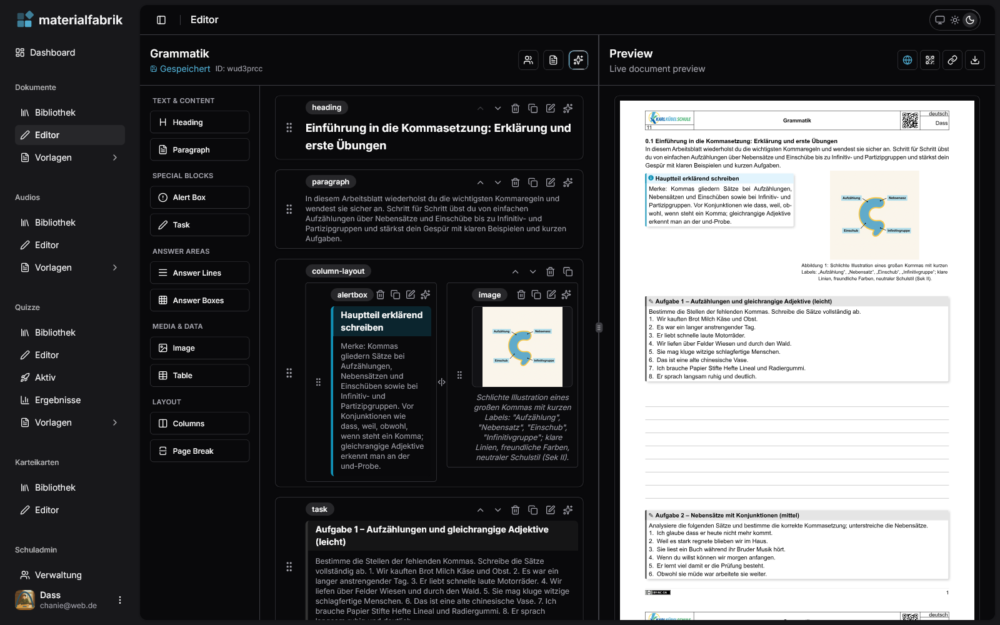
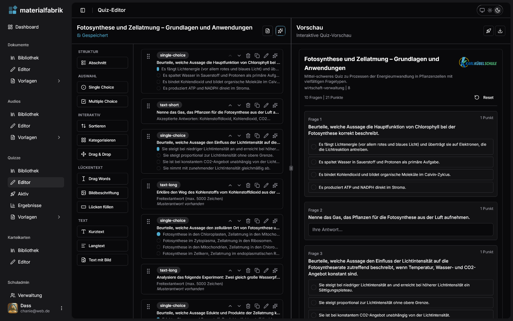
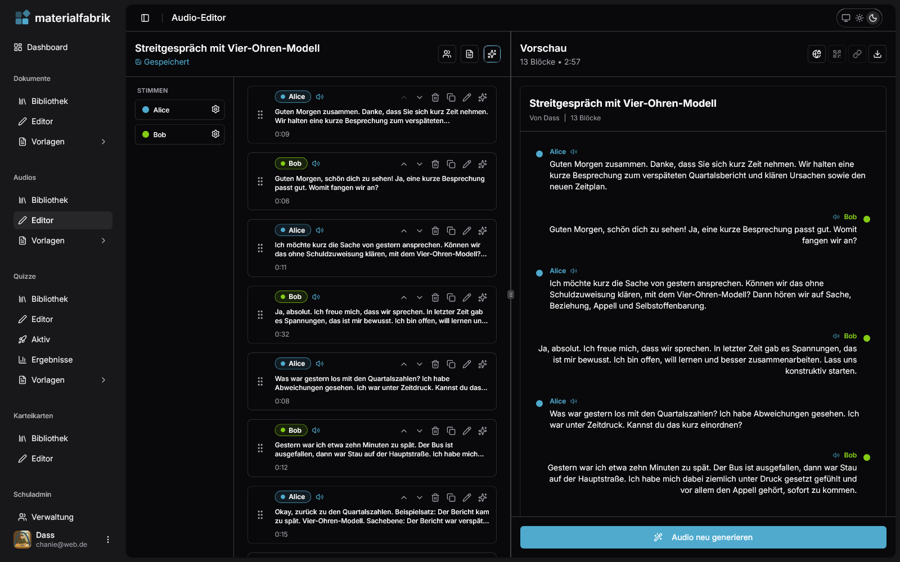
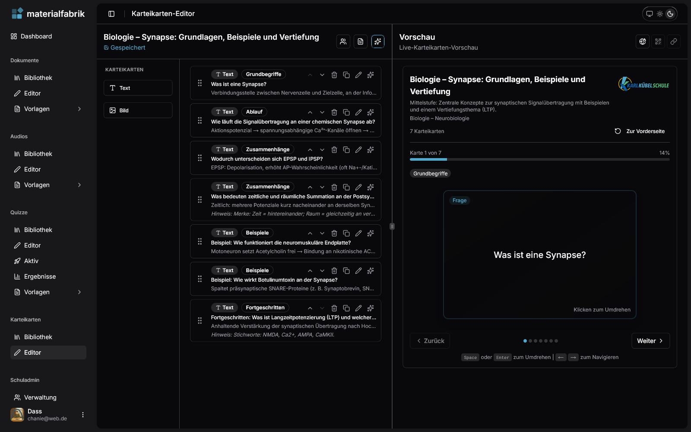

<p align="center">
  
</p>

<h1 align="center">materialfabrik</h1>

<p align="center">
  <em>Das KI-Werkzeug für Unterrichtsmaterial</em>
</p>

<p align="center">
  
  
  
  
  
  
  
  
  
  
</p>

<p align="center">
  <a href="https://beta.materialfabrik.de">🔗 Live-Demo</a>
</p>

---

## Über das Projekt

**materialfabrik** ist eine Webanwendung für Lehrkräfte, mit der Arbeitsblätter, Tests, Klausuren, Quizze, Audiokonversationen und Karteikarten erstellt werden können — unterstützt durch KI-Generierung und Live-Vorschau direkt im Browser.

Die Plattform richtet sich an alle Schulformen (Gymnasium, Realschule, Berufsschule, Gesamtschule u.a.) und wird aktiv im Unterricht eingesetzt.

> **Hinweis:** Dieses Repository dient als Projektvorstellung. Der Quellcode ist nicht öffentlich verfügbar.

---

## Features

### 📄 Dokumente

Drag-and-Drop-Editor mit über 10 Blocktypen (Überschriften, Aufgaben, Alertboxen, Antwortzeilen, Bilder u.v.m.) und Live-PDF-Vorschau. Die PDF-Erzeugung läuft vollständig im Browser über den Typst-WASM-Compiler.

<p align="center">
  
</p>

### ❓ Quizze

Interaktive Quizze mit 11 Fragetypen — von Single-/Multiple-Choice über Zuordnung und Sortierung bis hin zu Lückentexten und Drag-and-Drop. Mit automatischer Bewertung, Prüfungsmodus (beaufsichtigte Klausuren mit Anti-Cheat) und Echtzeit-Monitoring.

<p align="center">
  
</p>

### 🎧 Audio

Audiokonversationen mit mehreren Stimmen über Text-to-Speech (13 Sprachen). Erstellte Gespräche können als WAV, Transkript, HTML oder SRT-Untertitel exportiert werden — ideal für Hörverstehensübungen.

<p align="center">
  
</p>

### 🃏 Karteikarten

Lernsets mit Text- und Bildkarten, Kategorien und Hinweisen. Interaktive Vorschau mit Tastatursteuerung und KI-gestützter Generierung ganzer Kartensets.

<p align="center">
  
</p>

---

## Technologie-Stack

| Kategorie | Technologie |
|-----------|-------------|
| Framework | Next.js 16, React 19, TypeScript |
| Styling | Tailwind CSS, shadcn/ui |
| Datenbank | PostgreSQL, Prisma, Redis |
| PDF-Engine | Typst WASM (clientseitig) |
| KI | Vercel AI SDK (OpenAI, Gemini, Perplexity) |
| Echtzeit | Redis Pub/Sub + Server-Sent Events |
| Testing | Vitest, Playwright |

---

## Architektur

```
Blöcke bearbeiten → Typst-Code generieren → WASM-Compiler → SVG/PDF → Live-Vorschau
```

Die gesamte PDF-Kompilierung findet clientseitig im Browser statt. Dokumente werden als strukturierte JSON-Blöcke gespeichert und über einen Converter in Typst-Quellcode umgewandelt — unter Nutzung des eigenen `typ-notes`-Pakets für erweiterte Typografie (Alertboxen, Badges, Baumdiagramme, Spielkarten u.v.m.).

Echtzeit-Kollaboration läuft über Redis Pub/Sub mit SSE-Streaming und automatischem Polling-Fallback.

---

## Autor

**Navin Dass** — Studienrat für Mathematik, Informatik, Wirtschaft und Verwaltung an der Karl Kübel Schule, Bensheim.

- Website: [trivial.xyz](https://trivial.xyz)
- GitHub: [@otlz](https://github.com/otlz)

---

<p align="center">
  <sub>Dieses Repository enthält keinen Quellcode. Alle Rechte vorbehalten. © 2025 Navin Dass</sub>
</p>
